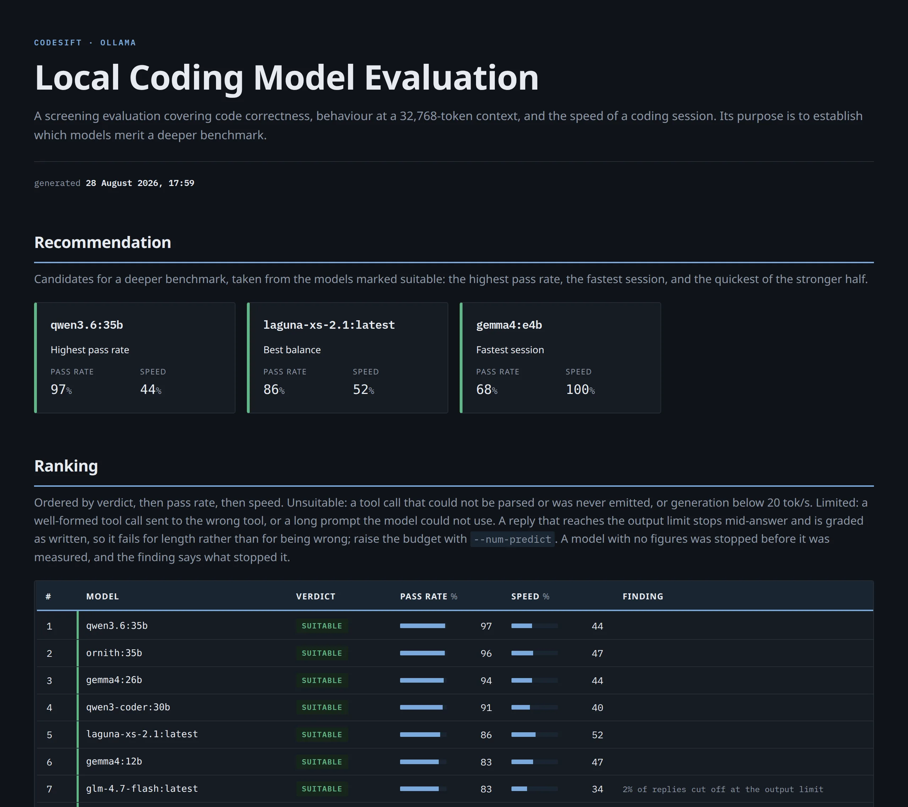

# llm-codesift

llm-codesift is a screening harness for coding models served by a local Ollama instance. It
executes a fixed set of programming tasks against each model, verifies the generated code by
running it, measures the speed of a coding session at a realistic context depth, and produces an
HTML report identifying the models that warrant a deeper benchmark.



Model-written code is executed without a sandbox. It runs with the privileges of the invoking
user and with unrestricted access to the filesystem and the network, and can therefore damage the
host system. Running the harness inside a virtual machine is strongly recommended.

## Requirements

- Python 3.9 or newer
- A reachable Ollama server
- The models to be evaluated, already installed on that server

## Installation

Linux and macOS:

```bash
python3 -m venv .venv
source .venv/bin/activate
pip install .
```

Windows:

```bash
python -m venv .venv
.venv\Scripts\activate
pip install .
```

## Quick Start

```bash
codesift run --models qwen3.5:9b granite4.1:8b gemma4:12b -o report.html
```

Without `--models`, every model installed on the server is evaluated. Results are recorded as
they are measured, so an interrupted run resumes rather than repeats. `codesift run --help` lists
the remaining options.

Progress is written as [TAP version 14](https://testanything.org/tap-version-14-specification.html).

## Model Discovery

`discover` scans the model listing in the Ollama library and reports the models that match the
given criteria.

```bash
codesift discover --coding --max-params 35 --write-models candidates.txt
```

`codesift discover --help` lists the criteria and their defaults.

`--write-models` writes the result as pull commands, one per line:

```bash
ollama pull gemma4:26b
```

The file installs the candidates and is also accepted by `--models-file`, which strips the
prefix.

As a rule of thumb, consider dense models that fit in VRAM and mixture-of-experts models that fit
in RAM. A dense model whose weights exceed VRAM generates too slowly to be worth screening, while
a mixture of experts moves only its active parameters per token and stays usable well beyond the
capacity of the card.
